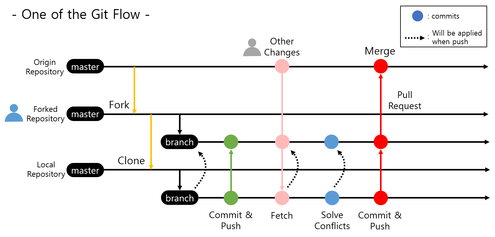
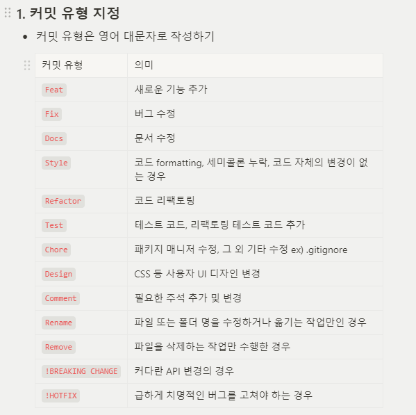

# Studi

---

### 프로젝트 소개 
> 스터디 인원 및 팀 프로젝트 팀원을 모집하는 플랫폼 서비스

---
### Git hub로 팀 프로젝트 진행하기(필독)


```text
1. 팀장 Repository에서 자신의 Repository에 `Fork` 해온다
2. `Fork`해온 내용에서 기능을 구현할 브랜치 생성
3. Local(내 컴퓨터)에 `clone`(최초 1회) or `pull`
4. 기능 구현
5. 팀장 레포지토리(upstream)에서 `sync fork`  → `pull`
6. 충돌 확인 후 `commit` → `push` (본인의 github 레포지토리에)
7. 팀장 레포지토리에 `pull request`
```
## 🖤 커밋 메시지 컨벤션

<aside>

### 1. 커밋 유형 지정

- 커밋 유형은 영어 대문자로 작성하기

### 2. 제목과 본문을 빈행으로 분리

- 커밋 유형 이후 제목과 본문은 한글로 작성하여 내용이 잘 전달될 수 있도록 할 것
- 본문에는 변경한 내용과 이유 설명 (어떻게보다는 무엇 & 왜를 설명)

### 3. 제목 첫 글자는 대문자로, 끝에는 `.` 금지

### 4. 제목은 영문 기준 50자 이내로 할 것

### 5. 자신의 코드가 직관적으로 바로 파악할 수 있다고 생각하지 말자

### 6. 여러가지 항목이 있다면 글머리 기호를 통해 가독성 높이기

```
- 변경 내용 1
- 변경 내용 2
- 변경 내용 3
```

</aside>